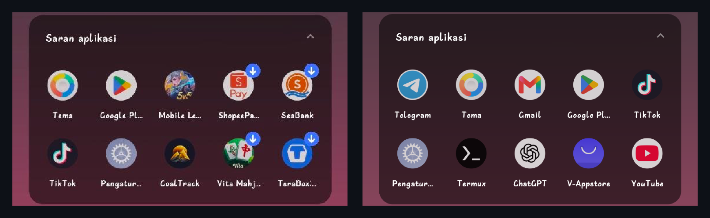
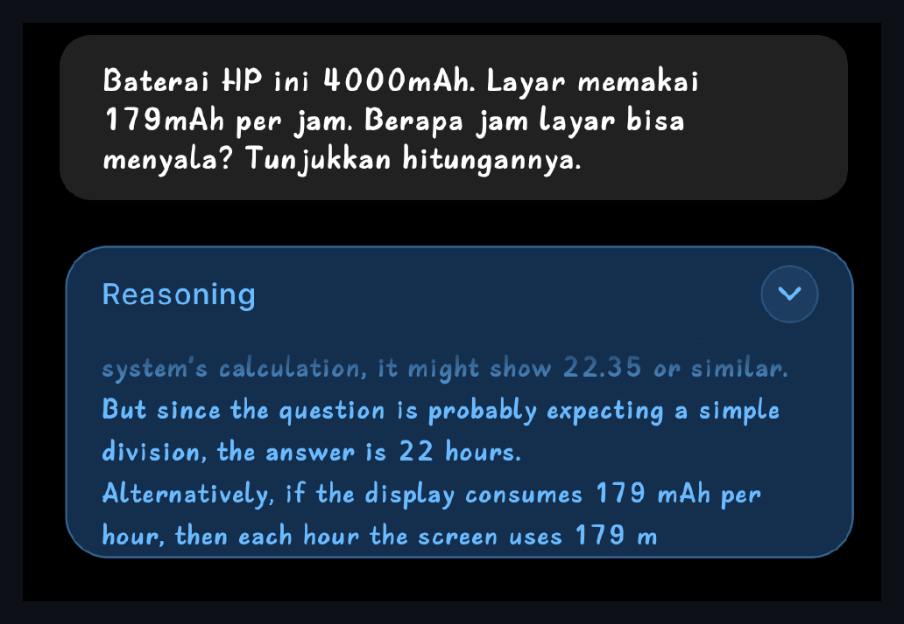

# adb-kit

**Toolkit debloat & optimasi Android tanpa root, lewat ADB nirkabel.**

Hapus bloatware OEM, matikan permukaan iklan bawaan, dan percepat perangkat —
cukup dengan mengaktifkan *Debugging nirkabel*. Tanpa root, tanpa unlock
bootloader, tanpa membatalkan garansi. Semua perubahan bisa dibatalkan.



> **Kiri — sebelum.** Kartu "Saran aplikasi" menyisipkan empat aplikasi promosi berbayar
> (ikon berpanah-unduh): ShopeePay, SeaBank, Vita Mahjong, TeraBox.
> **Kanan — sesudah `debloat` + `tweaks`.** Hanya aplikasi milik pengguna.

**Hasil nyata pada vivo V21** (lihat [studi kasus](docs/case-study-vivo-v21.md)):

| | Sebelum | Sesudah |
|---|---|---|
| Paket terpasang | 327 | **275** |
| Frame time saat scroll | 18 ms | **12 ms** |
| Janky frames | 0,27% | **0,00%** |
| Iklan sistem | Jovi Home, Pencarian Global, push AppStore | **mati** |
| vivo Push baca notifikasi | ✅ bisa | **dicabut** |

---

## Kenapa ini aman

Penghapusan memakai `pm uninstall -k --user 0`, yang hanya mencabut aplikasi
**untuk penggunamu**. APK-nya **tetap berada di partisi sistem yang read-only**.
Artinya:

- Semua bisa dipulihkan kapan saja (`restore`)
- **Factory reset mengembalikan 100%** aplikasi bawaan
- Partisi sistem tidak pernah disentuh, jadi OTA tetap bisa jalan

Paket yang dikunci OEM (`DELETE_FAILED_USER_RESTRICTED`) tidak dipaksa. Toolkit
**menetralkannya** — mematikan kemampuannya, bukan paketnya:

| Pembatasan | Efek |
|---|---|
| `appops POST_NOTIFICATION ignore` | tidak bisa mengirim notifikasi (sumber iklan utama) |
| `appops RUN_*_IN_BACKGROUND ignore` | tidak bisa jalan di latar |
| `appops WAKE_LOCK / START_FOREGROUND ignore` | tidak bisa membangunkan perangkat |
| `am set-standby-bucket restricted` | dibekukan penjadwal sistem |
| `netpolicy restrict-background-blacklist` | data latar diblokir |
| `deviceidle whitelist -pkg` | dikeluarkan dari pengecualian hemat daya |

---

## Mulai cepat

```bash
git clone <repo-url> && cd adb-kit

# 1. Di HP: Setelan > Sistem > Opsi pengembang > Debugging nirkabel > ON
# 2. Tap "Sematkan perangkat dengan kode sematan", catat IP:PORT dan KODE 6 digit
./adb-kit.sh connect 192.168.1.5:41234 123456

./adb-kit.sh scan        # profilkan perangkat, lihat kandidat bloat
./adb-kit.sh debloat     # hapus (minta konfirmasi)
./adb-kit.sh tweaks      # DNS pemblokir iklan, animasi, dll
./adb-kit.sh doctor      # cek kesehatan & regresi
```

Butuh `adb` (android-platform-tools) dan `bash`.
macOS: `brew install --cask android-platform-tools`

---

## Perintah

| Perintah | Fungsi |
|---|---|
| `connect [IP:PORT KODE]` | sambung; pairing bila argumen diberikan; auto-discover via mDNS |
| `scan [profil]` | simpan snapshot paket + daftar kandidat bloat |
| `debloat [profil]` | hapus bloat; yang dikunci OEM dinetralkan otomatis |
| `debloat --with-optional` | sertakan tier opsional (pilihan pribadi, lihat di bawah) |
| `tweaks [profil]` | terapkan setelan dari profil |
| `check [profil]` | periksa setelan **tanpa mengubah apa pun** |
| `doctor` | kesehatan sistem + deteksi paket/setelan yang kembali |
| `restore <paket...>` | pulihkan paket tertentu |
| `restore --all` | pulihkan semuanya |
| `restore --unmute` | batalkan penetralan saja |
| `profiles` | daftar profil tersedia |

---

## Profil

Profil adalah berkas shell sederhana di `profiles/`. Toolkit memilihnya otomatis
dari `ro.product.brand`.

| Profil | Merek | Isi |
|---|---|---|
| `vivo-funtouch` | vivo, iQOO | 60 paket + 15 saklar tersembunyi Funtouch |
| `generic` | semua (fallback) | 7 paket aman universal + setelan dasar |

### Membuat profil baru

```bash
cp profiles/generic.conf profiles/xiaomi-miui.conf
```

```sh
# brands: xiaomi redmi poco        <- dicocokkan ke ro.product.brand
OEM_PATTERN='xiaomi|miui|redmi'    <- untuk menyorot sisa paket OEM saat scan

REMOVE="
com.miui.analytics
com.miui.msa.global
"

# Opsional: aman dihapus tapi PILIHAN PRIBADI (aplikasi yang banyak dipakai
# orang). Hanya ikut terhapus bila dijalankan dengan --with-optional.
REMOVE_OPTIONAL="
com.miui.weather2
"

# format: namespace kunci nilai  # label
SETTINGS="
global window_animation_scale 0  # Animasi window
"

DENSITY=420                       # opsional
NOTIF_LISTENER_DENY="pkg/komponen"   # opsional
```

Jalankan `./adb-kit.sh scan` — bagian *"Sisa paket OEM yang BELUM dikenali profil"*
menunjukkan kandidat untuk ditambahkan. **Pull request profil baru sangat diterima.**

---

## Setelah reboot: sebagian akan kembali

Ini penting dan sering terlewat. Diuji pada vivo V21 — setelah satu kali reboot:

- aplikasi yang dihapus **tetap hilang** ✅
- tetapi Netflix terpasang ulang oleh sistem
- `upload_apk_enable` hidup lagi
- vivo Push **mendapat kembali akses baca-notifikasi**
- overlay gesture kembali ke bawaan

Karena itu ada `doctor`:

```bash
./adb-kit.sh doctor                      # apa yang kembali?
./adb-kit.sh debloat && ./adb-kit.sh tweaks   # perbaiki
```

Semua perintah **idempoten** — aman dijalankan berulang kali.

---

## Yang TIDAK bisa dilakukan toolkit ini

Jujur di muka, supaya tidak salah harap:

- **Menaikkan refresh rate.** Kalau panel 60 Hz, itu batas fisik. `scan` menampilkan
  mode yang benar-benar ada.
- **Mempercepat internet.** Kecepatan ditentukan jalur ISP. Bandingkan throughput LAN
  vs internet dulu sebelum menyalahkan perangkat.
- **Menambal OS.** Kalau vendor berhenti mengirim patch keamanan, tidak ada tweak
  yang menggantikannya.
- **Menghapus paket yang dikunci OEM.** Hanya bisa dinetralkan (lihat tabel di atas).
- **Menyembunyikan ikon paket yang dinetralkan.** Ikonnya tetap muncul di laci
  aplikasi karena paketnya tidak benar-benar di-uninstall; `pm hide` butuh root.

---

## Struktur

```
adb-kit.sh              entry point
lib/common.sh           koneksi, deteksi perangkat, pemilihan profil, pengaman
modules/                connect · scan · debloat · tweaks · restore · doctor
profiles/*.conf         daftar paket + setelan per merek
devices/<brand-model>/  snapshot & catatan per perangkat (dibuat otomatis)
docs/                   studi kasus
```

`devices/` berisi snapshot paket dan catatan apa yang dihapus/dinetralkan per
perangkat, sehingga `doctor` dan `restore` tahu harus memulihkan apa.

---

## Studi kasus

[`docs/case-study-vivo-v21.md`](docs/case-study-vivo-v21.md) — catatan lengkap
sesi yang melahirkan toolkit ini: vivo V21 (V2108), Funtouch OS 12, dari 327 → 275
paket. Berisi juga hal-hal yang **gagal** dan sebabnya, hasil pengukuran nyata
(frame time, throughput jaringan, baterai), dan cara menemukan saklar tersembunyi
OEM lewat `settings list` dan `uiautomator dump`.

---

## Bonus: AI lokal 100% offline

Perangkat Android modern sanggup menjalankan LLM secara lokal. Cek dukungan
instruksi ARM dot-product (`asimddp`) di keluaran `scan` — bila ada, inferensi
int8 berjalan beberapa kali lebih cepat.



> Qwen3 1.7B berjalan **sepenuhnya offline** di Snapdragon 730G, menalar langkah demi
> langkah dan sampai pada jawaban benar: `4000 ÷ 179 ≈ 22,35 jam`.

Diuji pada Snapdragon 730G:

| Model | Ukuran | Kecepatan | Aritmatika |
|---|---|---|---|
| Gemma 3 1B | 806 MB | ~10 token/detik | ❌ salah |
| Qwen3 1.7B | 1,28 GB | lebih lambat, mode *thinking* | ✅ **benar** |

**Temuan penting:** menyetel *prompt* dan parameter memperbaiki **bentuk** jawaban —
struktur, keringkasan, kejujuran — tetapi **tidak menambah kemampuan menalar**.
Untuk itu, modelnya yang harus diganti. Rinciannya ada di studi kasus.


---

## Lisensi

MIT
